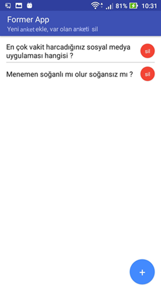
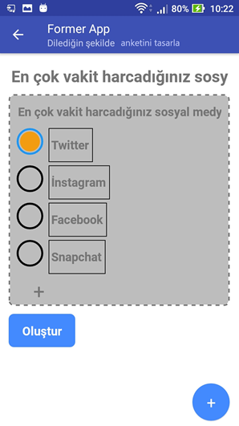
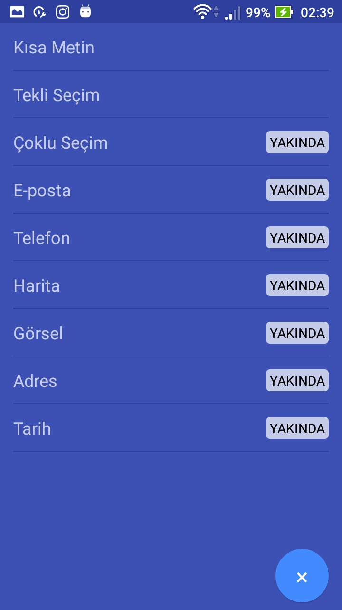
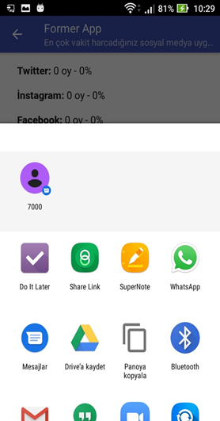
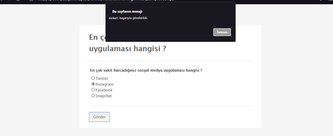
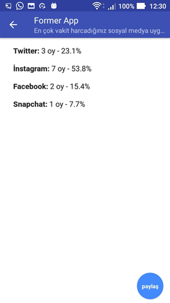

# FormerApp

## About The Project

In this project, after users register for the application, they are directed to the 'Create Form' page by clicking the corresponding button on the main screen. On the form creation page, they can design the desired form by adding elements necessary for the form such as text fields, checkboxes, input areas, and more. They have the ability to share the created form with other users via a unique link or on social media platforms. Other users who click on this link are directly directed to a web page and prompted to fill out the form. The user who created the form can view responses and detailed statistics related to this form.

 
 
  
 

## Used Libraries

- @react-native-firebase/auth
- @react-native-firebase/firestore
- react-native-navigation
- react-native-share
